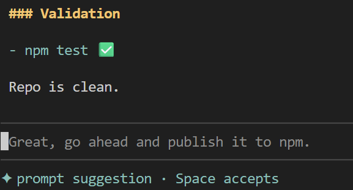

# pi-prompt-suggester

`pi-prompt-suggester` suggests the user's likely next prompt after each assistant completion.

It uses recent conversation context plus a lightweight project intent seed so suggestions stay aligned with what the user has been doing in the current repo.



## Highlights

- next-prompt suggestions as ghost text in the editor
- repo-aware suggestions grounded in project intent
- persistent custom instruction you can edit in the TUI
- project- or user-scoped behavior overrides

## Install

[npm package](https://www.npmjs.com/package/@guwidoe/pi-prompt-suggester)

Global install:

```bash
pi install npm:@guwidoe/pi-prompt-suggester
```

Project-local install:

```bash
pi install -l npm:@guwidoe/pi-prompt-suggester
```

Pin a version if needed:

```bash
pi install npm:@guwidoe/pi-prompt-suggester@0.1.30
```

After install, restart `pi` or run `/reload`.

### Manual settings.json entry

Add to `packages` in `~/.pi/agent/settings.json` or `.pi/settings.json`:

```json
{
  "packages": ["npm:@guwidoe/pi-prompt-suggester"]
}
```

## Usage

### Main entrypoint

This local fork is intentionally lean. Runtime customization comes only from Pi's agent settings file, `~/.pi/agent/settings.json`.

### Everyday behavior

- after an assistant completion, the extension may suggest the next user prompt
- when the editor is empty and the suggestion is compatible, it appears as ghost text
- by default, Right Arrow accepts the full suggestion and Enter accepts/sends it

### Common commands

- `/suggester` or `/suggester status` — inspect current status
- `/suggester reseed` — refresh project intent in the background
- `/suggester seed-trace ...` — inspect seeder log events

## Configuration

Add a `promptSuggester` object to `~/.pi/agent/settings.json`:

```json
{
  "promptSuggester": {
    "suggesterModel": "session-default"
  }
}
```

Only `promptSuggester.suggesterModel` is supported as a custom setting. All other values come from package defaults in [`config/prompt-suggester.config.json`](./config/prompt-suggester.config.json).

## Docs

For implementation details, architecture, and maintainer-oriented notes, see:

- [`docs/architecture.md`](./docs/architecture.md)
- [`docs/architecture-decisions.md`](./docs/architecture-decisions.md)
- [`docs/transcript-cache-experiment.md`](./docs/transcript-cache-experiment.md)
- [`docs/transcript-cache-evaluation.md`](./docs/transcript-cache-evaluation.md)
- [`docs/meta-prompts.md`](./docs/meta-prompts.md)
- [`docs/roadmap.md`](./docs/roadmap.md)
